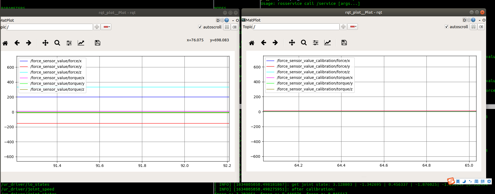

## **Force Sensor Tools**
***
### 描述
Force Sensor Tools提供宇立公司生产的M3705C力/力矩传感器的ROS**驱动**、**标定**等一系列工具。
### 依赖
* 正确接线并配置串口，请参照srisensor包的README和传感器调试文档；
* 安装ROS串口包，使用如下指令：
```
    sudo apt-get install ros-melodic-serial
```
* 安装RobWork，并且正确设置 **RW_ROOT** 环境变量用于编译，具体安装方式请参照ur_vision_servo包的README；
* 安装Eigen3算法库，使用如下指令：
```
    sudo apt-get install libeigen3-dev
```
* 编译Force Sensor Tools，完成上述步骤后，在ws_ros1目录下执行：
```
    catkin_make --only-pkg-with-deps force_sensor_tools
```
### 使用方法
Force Sensor Tools工具的使用分为两个步骤：1.标定、2.使用标定生成的XML文件用于修正传感器误差。

**Step 1 标定**

* 启动机器人，运行ur driver：
```
    roslaunch ur_driver ur5_bringup.launch
```
* 分别启动传感器驱动和标定程序：
```
    rosrun force_sensor_tools driver
    rosrun force_sensor_tools calibration
```
* 移动机器人到不同位姿，并且执行如下命令，calibration程序记录当前的机器人位姿和传感器数值
```
    rosservice call /add_position
```
> 工具提供了清除当前所有已经添加点的功能，只要执行 `rosservice call /clear_position`就能将所有的已添加点清除，重新开始该步骤。
* 在记录超过8个点后，执行如下命令，calibration程序会完成标定计算，并且在calibration的执行目录下创建 `calibration_config.xml` ,该文件中中包含着计算得到的集合参数，这些集合参数在 **Step2** 中用于修正传感器误差
```
    rosservice call /calibration
```


**Step 2 修正误差**
* 将 **Step1** 得到的`calibration_config.xml`的绝对路径配置到环境变量 **FORCE_SENSOR_CONFIG** 中：
```
    export FORCE_SENSOR_CONFIG=(calibration_config.xml的绝对路径)
```
* 配置好串口并且启动ur driver
* 启动传感器driver
```
    rosrun force_sensor_tools driver
```
* 传感器驱动会以 `force_sensor_value` 为Topic发送标定前的传感器数值， 以 `force_sensor_value_calibration` 为Topic发送标定后的数值
* 运行如下指令后能得到实时的传感器数据：
```
rosrun rqt_plot rqt_plot /force_sensor_value/force/x:y:z /force_sensor_value/torque/x:y:z
rosrun rqt_plot rqt_plot /force_sensor_value_calibration/force/x:y:z /force_sensor_value_calibration/torque/x:y:z
```
如下图所示标定后的传感器参数接近于0，符合预期。


### 技术支持
* 汪涛
* 参考文献：工业机器人柔顺轴孔装配方法研究_邹鹏
